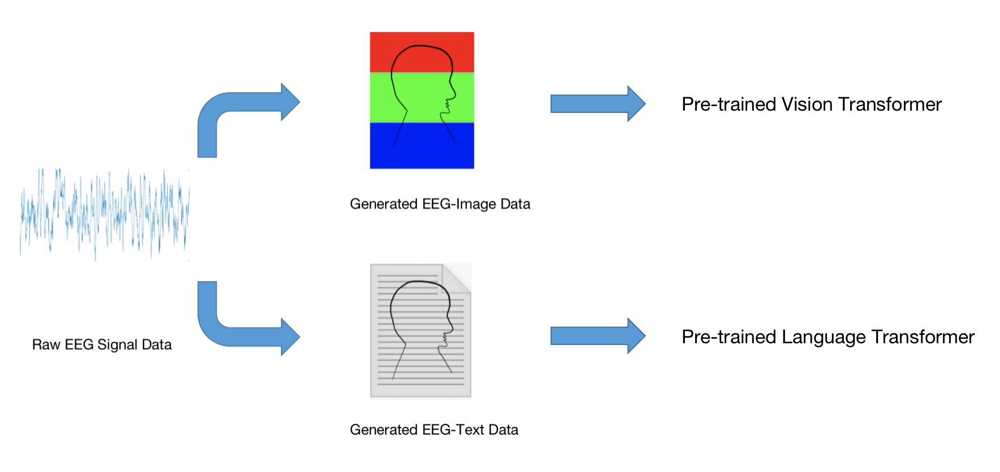
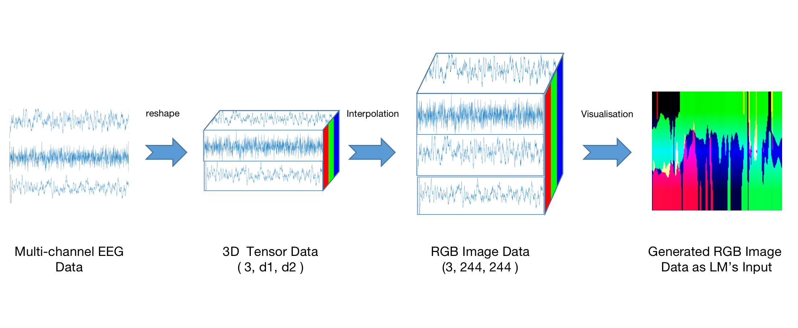

# AdaCE
Official [PyTorch](https://pytorch.org/) implementation of  AdaCE
> **Abstract:** Pre-trained large transformer models have achieved remarkable performance in the fields of natural language processing and computer vision. Since the magnitude of available labeled electroencephalogram (EEG) data is much lower than that of text and image data, it is difficult for transformer models pre-trained from EEG to be developed as large as GPT-4 100T to fully unleash the potential of this architecture. In this paper, we show that transformers pre-trained from images as well as text can be directly fine-tuned for EEG-based prediction tasks. We design AdaCE, plug-and-play Adapters for Converting EEG data into image as well as text forms, to fine-tune pre-trained vision and language transformers. The proposed AdaCE module is highly effective for fine-tuning pre-trained transformers while achieving state-of-the-art performance on diverse EEG-based prediction tasks. For example, AdaCE on the pre-trained Swin-Transformer achieves 99.6%, an absolute improvement of 9.2%, on the EEG-decoding task of human activity recognition (UCI HAR). Furthermore, we empirically show that applying the proposed AdaCE to fine-tune larger pre-trained models can achieve better performance on EEG-based predicting tasks, indicating the potential of our adapters for even larger transformers. The plug-and-play AdaCE module can be applied to fine-tuning most of the popular pre-trained transformers on many other time-series data with multiple channels, not limited to EEG data and the models we use. 

  

  

> **Top**: Framework of **AdaCE**: Adapting raw EEG data into text and image for tuning pre-trained large transformer model. 
> **Bottom**: EEG-to-Image adapter: Converting EEG data into images to maintain the complete feature information. 
> **Our code will be released soon.**

------

